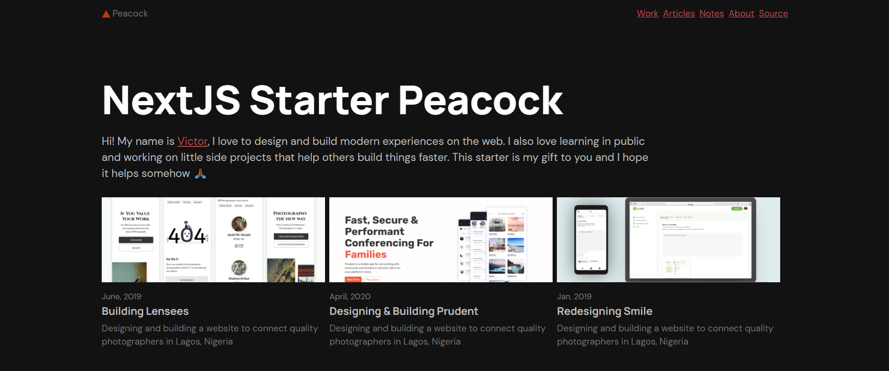

## Features

- Styled with EmotionJS💅🏾
- Written in TypeScript ⚛
- Blog, Notes and Work content types 🖊

## Getting Started

1. Fork the project. (It's highly recommended to fork the project to get upcoming features and bug fixes)

2. Clone your fork

```bash
git clone https://github.com/<your-username>/next-starter-peacock.git
```

3. Jump into the directory and Install dependencies

```bash
cd next-starter-peacock && yarn

or

cd next-starter-peacock && npm install
```

4. Start the dev server

```bash
yarn dev

or

npm run dev
```
