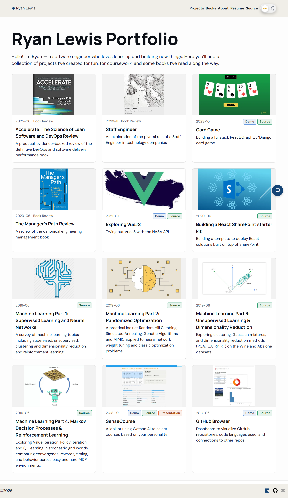

# Ryan Lewis Portfolio

The source for [rylew.dev](https://www.rylew.dev), Ryan Lewis's personal
portfolio. It combines statically generated project and book pages, a
profile-driven About page, and a server-side AI assistant that answers questions
from the same biographical and portfolio content shown on the site.

[View the live site](https://www.rylew.dev) ·
[About Ryan](https://www.rylew.dev/about) ·
[View résumé](https://www.rylew.dev/Ryan-Lewis-Resume.pdf)



## What is in the repository

- **Next.js Pages Router:** listing and detail routes are statically generated
  from local content; `/api/chat` remains a server-side API route.
- **File-backed publishing:** project and book entries are Markdown with YAML
  front matter, transformed with remark, GitHub Flavored Markdown, rehype, and
  Prism syntax highlighting.
- **One profile source:** `me/profile.json` supplies the About page directly and
  generates the biographical context used by chat.
- **Context-aware AI assistant:** the API combines the profile summary, compact
  indexes of every project and book, and keyword-selected article details before
  calling Groq.
- **Accessible, responsive UI:** Emotion styles support light and dark themes,
  keyboard navigation, a focus-managed mobile menu, and desktop/mobile axe
  checks.

## Architecture and content model

| Area                   | Source                                       | Build/runtime path                                                                  |
| ---------------------- | -------------------------------------------- | ----------------------------------------------------------------------------------- |
| Projects               | `content/project/*.md`                       | `lib/content.ts` → `/projects`, `/projects/[id]`, and project tag pages             |
| Books                  | `content/book/*.md`                          | `lib/content.ts` → `/books`, `/books/[id]`, book tag pages, and book category pages |
| Tags and categories    | `config/tags.json`, `config/categories.json` | Static paths and labels for taxonomy routes                                         |
| About                  | `me/profile.json`                            | Imported through `lib/profile.ts` by `/about`                                       |
| Profile chat context   | `me/profile.json`                            | `scripts/generate-summary.ts` → `me/summary.txt`                                    |
| Portfolio chat context | Project and book Markdown                    | `scripts/generate-chat-context.ts` → `me/chat-context.json`                         |
| AI assistant           | Generated context plus visitor input         | `/api/chat` → Groq Chat Completions                                                 |

Markdown front matter supplies fields such as `title`, `date`, `slug`,
`description`, `previewImage`, `tags`, and `selectedWork`. Project entries can
also expose `liveSite`, `sourceCode`, and `presentation` links. `lib/content.ts`
reads those files at build time, renders Markdown to HTML, sorts listings by
date, and supplies the static route props.

The homepage is the date-sorted combination of project and book entries whose
front matter has `selectedWork: true`.

## Local setup

The package declares **Node.js 22.x**.

```bash
git clone https://github.com/rylew2/portfolio-rylew.git
cd portfolio-rylew
npm install
```

Create `.env.local` only if you want the chat endpoint to call Groq:

```dotenv
GROQ_API_KEY=your_groq_api_key
```

Then start the development server:

```bash
npm run dev
```

Open [http://localhost:3000](http://localhost:3000). Pages work without an API
key; chat returns a generic service-unavailable response until
`GROQ_API_KEY` is set.

### Environment variables

| Variable       | Required      | Purpose                                                                                                                                           |
| -------------- | ------------- | ------------------------------------------------------------------------------------------------------------------------------------------------- |
| `GROQ_API_KEY` | For chat only | Read server-side by `/api/chat` and sent as the bearer token to Groq. It is never a `NEXT_PUBLIC_*` value.                                        |
| `ANALYTICS_ID` | No            | Legacy Google Analytics ID read by `lib/gtag.ts` and injected by `pages/_document.tsx`. Vercel Analytics is also active through `pages/_app.tsx`. |
| `CI`           | No            | Used by Playwright configuration to decide whether an existing test server may be reused.                                                         |

No other application environment variables are read by the tracked source.
`.env.local` and the standard development, test, and production variants listed
in `.gitignore` are ignored.

## Scripts and tests

| Command                    | What it does                                                                      |
| -------------------------- | --------------------------------------------------------------------------------- |
| `npm run dev`              | Starts the Next.js development server.                                            |
| `npm run build`            | Runs `prebuild`, type-checks, and creates the optimized Next.js production build. |
| `npm run start`            | Serves an existing production build.                                              |
| `npm run generate:summary` | Regenerates `me/summary.txt` from `me/profile.json`.                              |
| `npm run generate:context` | Regenerates `me/chat-context.json` from project and book Markdown.                |
| `npm run prebuild`         | Runs both context generators; npm invokes it automatically before `build`.        |
| `npm run test:unit`        | Runs the TypeScript unit suite with Node's test runner through `tsx`.             |
| `npm run test:e2e`         | Runs Playwright against a managed development server on port 3000.                |
| `npm run test:e2e:ui`      | Opens Playwright's interactive UI on `127.0.0.1`.                                 |
| `npm run format`           | Formats the repository with Prettier.                                             |
| `npm run format:check`     | Checks repository formatting without writing files.                               |

The unit suite exercises chat input validation, role sanitization, per-client
rate limiting, timeout behavior, upstream failure handling, and response-shape
validation. Browser tests cover listing completeness, content and taxonomy
navigation, card interactions, the profile-driven About page, résumé delivery,
keyboard behavior, and mobile-menu focus management.

The accessibility suite runs axe against home, listing, About, and representative
detail pages in both themes at desktop and mobile viewports. It checks WCAG 2 A,
AA, 2.1 A/AA, 2.2 AA, and axe best-practice tags, with additional regressions
for the skip link, control target size, menu focus containment, and chat-header
contrast.

## Generated About and chat context

Two generated files keep the assistant aligned with the public site:

```text
me/profile.json ───────────────→ /about
       └─ generate:summary ────→ me/summary.txt ─┐
                                                 ├─→ /api/chat
content/{project,book}/*.md ───→ static pages    │
       └─ generate:context ────→ chat-context.json ┘
```

`me/summary.txt` contains the profile's biography, experience, education,
certifications, skills, volunteering, interests, and contact links.
`me/chat-context.json` contains condensed Markdown bodies and front matter; its
generator removes fenced code, image references, and HTML before writing the
file. Both outputs are tracked so a content update can be reviewed as source and
generated context together.

## Retrieval and Groq request flow

For a normal question, `/api/chat` lowercases and tokenizes the message,
discarding tokens shorter than three characters. Each project and book earns,
per query token:

| Match location | Score |
| -------------- | ----: |
| Title          |     5 |
| Tag            |     3 |
| Description    |     2 |
| Body content   |     1 |

An explicit title or slug match takes precedence. Recognized “all projects” or
“all books” questions select the complete corresponding collection; otherwise
the API selects up to three top-scoring projects and three books. The prompt
always includes compact metadata summaries for every item, plus selected detail
bodies truncated to 1,400 characters each.

The server prepends that context and the profile summary as a system message,
adds validated `user`/`assistant` history, then sends the current message to
Groq's OpenAI-compatible chat-completions endpoint. The checked-in request uses
`llama-3.3-70b-versatile` with `max_tokens: 500`.

## API hardening

`/api/chat` accepts `POST` only and applies these bounds before any Groq call:

- message: 1–1,000 characters after trimming;
- history: at most 12 `user` or `assistant` entries;
- each history entry: 1–1,000 characters after trimming;
- combined history content: at most 6,000 characters.

The in-memory limiter allows 10 attempts per client in a rolling 60-second
window, caps stored client buckets at 10,000, and cleans expired buckets on a
60-second cadence. Client identity uses the first `x-forwarded-for` value, then
the socket address, then a stable fallback.

Groq requests have a 10-second timeout. Non-success responses have their bodies
cancelled where possible, response JSON is shape-checked, and visitors receive
generic errors rather than upstream payloads or configuration details. Visitor
messages and history are marked as untrusted in the system prompt.

These controls reduce accidental and low-volume abuse; they are not a
distributed security boundary. The rate limiter is process-local and resets
when a server instance restarts.

## Content updates and deployment

1. Edit `content/project/*.md` or `content/book/*.md`. Add every published tag
   to `config/tags.json`; book categories come from `config/categories.json`.
2. Edit biographical facts in `me/profile.json`, not the About page or generated
   summary.
3. Run `npm run generate:summary` and `npm run generate:context`, or let
   `npm run build` run both through `prebuild`.
4. Review and commit the source files together with changes to
   `me/summary.txt` and `me/chat-context.json`.
5. Run `npm run test:unit`, `npm run test:e2e`, and `npm run build` before
   publishing.

GitHub Actions provides repository checks and dependency-update automation:

- [`build.yml`](.github/workflows/build.yml) runs `npm ci` and the production
  build on pull requests and pushes to `master`, using Node.js 22.
- [`playwright.yml`](.github/workflows/playwright.yml) installs the Playwright
  browsers and runs the E2E suite on pull requests and pushes to `master`.
- [`dependabot-auto-merge.yml`](.github/workflows/dependabot-auto-merge.yml)
  enables squash auto-merge for Dependabot patch and minor version updates.

These workflows do not deploy the application, and no host deployment
configuration is checked in. The application contains Vercel Analytics and the
live site configuration points to `https://www.rylew.dev`; deployment automation
and environment management live outside this repository. The production
environment must provide `GROQ_API_KEY` if chat should be available.

## Tradeoffs

- **Build-time file system:** Markdown keeps publishing reviewable in Git and
  makes content pages static, but every content change requires a rebuild.
- **Committed generated context:** source/context drift is visible in review,
  but contributors must regenerate both chat files after relevant edits.
- **Lexical retrieval:** deterministic weighted matching is small and
  dependency-free, but it does not provide semantic similarity or stemming.
- **Process-local limiting:** no external datastore is needed, but limits are
  neither shared across instances nor durable across restarts.
- **Hosted inference:** the browser never receives the API key, but chat
  availability and latency depend on the server deployment and Groq.

## Links

- [Live portfolio](https://www.rylew.dev)
- [Source repository](https://github.com/rylew2/portfolio-rylew)
- [Ryan Lewis on GitHub](https://github.com/rylew2)
- [Ryan Lewis on LinkedIn](https://www.linkedin.com/in/ryan-lewis-378657a/)
